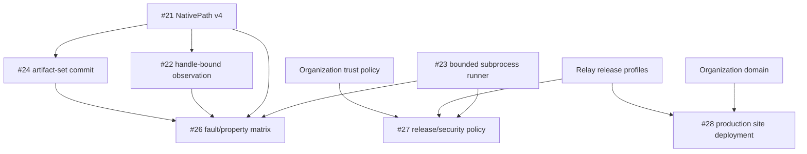

# OptiFlow Roadmap Reconciliation — 2026-08-20

## Purpose

This audit reconciles the historical OptiFlow audit/roadmap recommendations with the repository state on `main` after the architecture and product-site work merged.

Status values:

- **delivered** — evidence exists on `main` and the recommendation no longer needs an implementation issue;
- **open** — active work remains and is represented by a current GitHub issue;
- **superseded** — the old implementation direction was replaced by an accepted architecture;
- **rejected** — explicitly not part of the current product direction.

## Product and architecture baseline

| Recommendation | Status | Evidence / current owner |
| --- | --- | --- |
| Read-only exact-duplicate MVP | delivered | `ROADMAP.md` v0.1.0 section; Rust CLI, schemas, state, reports, plans, smoke tests on `main`. |
| Filesystem identity and hard-link-aware accounting | delivered | [PR #5](https://github.com/egohygiene/optiflow/pull/5). |
| Scan-time mutation detection and lossless path representation prototype | delivered as v3 precursor | [PR #7](https://github.com/egohygiene/optiflow/pull/7). Remaining lossless persisted-boundary work is #21. |
| Schema/SQLite/publication contract hardening | delivered | [PR #13](https://github.com/egohygiene/optiflow/pull/13). |
| Typed CLI outcome and exit-code contract | delivered | [PR #15](https://github.com/egohygiene/optiflow/pull/15). |
| Deterministic configuration/effective policy | delivered | [PR #16](https://github.com/egohygiene/optiflow/pull/16). |
| Complete 18-document architecture corpus | delivered | [PR #19](https://github.com/egohygiene/optiflow/pull/19). |
| Generated architecture portal | delivered | [PR #20](https://github.com/egohygiene/optiflow/pull/20). |

## Product-site baseline

| Recommendation | Status | Evidence / current owner |
| --- | --- | --- |
| Replace ad-hoc/mdBook documentation direction with reproducible product docs | superseded by Zensical | [PR #17](https://github.com/egohygiene/optiflow/pull/17) establishes pinned Zensical. No new mdBook surface should be introduced. |
| LaunchKit-derived landing page | delivered | [PR #18](https://github.com/egohygiene/optiflow/pull/18). |
| Deterministic static surface composition | delivered | [PR #18](https://github.com/egohygiene/optiflow/pull/18); `docs/site-publication.md`; `scripts/site/`. |
| Architecture visualization within public site | delivered | [PR #20](https://github.com/egohygiene/optiflow/pull/20). |
| Repository intelligence surface | delivered | [PR #34](https://github.com/egohygiene/optiflow/pull/34), consuming pinned Relay Repository Intelligence. |
| Production domain/DNS/TLS/rollback completion | open | #28; requires organization domain/deployment dependencies. |
| Generated rustdoc/release surfaces and final identity/motion polish | open / later | `docs/site-publication.md` explicitly keeps these separate from current checked-in surfaces. |

## Current P0 correctness work

These are the next product-safety blockers and remain intentionally independent of the site work:

| Issue | State | Dependency |
| --- | --- | --- |
| [#21 — NativePath schema v4](https://github.com/egohygiene/optiflow/issues/21) | open | none |
| [#23 — typed bounded subprocess runner](https://github.com/egohygiene/optiflow/issues/23) | open | none |
| [#22 — handle-bound observation evidence](https://github.com/egohygiene/optiflow/issues/22) | blocked | #21 |
| [#24 — artifact-set commit protocol](https://github.com/egohygiene/optiflow/issues/24) | blocked | #21 |

## Release-hardening work

| Issue | State | Dependency |
| --- | --- | --- |
| [#26 — adversarial fault/property-test matrix](https://github.com/egohygiene/optiflow/issues/26) | blocked | #21, #22, #23, #24 |
| [#27 — dependency/security/signed-release policy](https://github.com/egohygiene/optiflow/issues/27) | blocked | #23 plus Relay/org trust policy |
| [#28 — deploy composed product site](https://github.com/egohygiene/optiflow/issues/28) | blocked externally | organization domain + Relay publication contract |

## Reconciliation decisions

### Zensical is the accepted documentation engine

The earlier mdBook direction is superseded. Zensical is pinned, built strictly, composed beneath `/docs/`, and already exercised by the product site. Re-introducing mdBook would create a second documentation source/build path without a current requirement.

### LaunchKit is a design/source reference, not a runtime dependency

The landing shell is derived from LaunchKit conventions but the checked-in OptiFlow surface remains dependency-light static HTML/CSS/JS. Product claims must continue to reflect current implementation evidence rather than template marketing language.

### Architecture portal is a projection

The generated `/architecture/` output is disposable. Canonical architecture remains the 18 root architecture documents. Organization-level architecture generation/conformance belongs to Aether/Holon/Hygiene rather than becoming an OptiFlow platform responsibility.

### Repository Intelligence is consumed, not copied

OptiFlow consumes a pinned Relay producer for `/intelligence/`. The reusable intelligence implementation remains outside OptiFlow.

## Next release milestone

The next milestone is **v0.1.x release hardening**, not v0.2 mutation authority.

Exit requires:

1. lossless path identity through every persisted/artifact boundary (#21);
2. handle-bound observation evidence or explicit failure when equivalent guarantees cannot be established (#22);
3. bounded typed subprocess execution for ffprobe/future adapters (#23);
4. coherent artifact-set publication/recovery (#24);
5. adversarial/fault evidence after those foundations land (#26);
6. release/supply-chain policy after Relay/org trust dependencies are available (#27).

The existing site may continue to evolve independently, but it must not imply mutation capabilities or release guarantees that the CLI has not earned.

## Dependency graph

## Close/supersede guidance

- Historical audit tasks already represented by merged PR evidence should not be recreated as new issues.
- mdBook-specific tasks should be closed as superseded by Zensical unless they contain an independently useful requirement not covered by the accepted stack.
- New correctness findings should attach to #21–#24 or become a focused issue with an explicit dependency edge rather than expanding this reconciliation issue.
