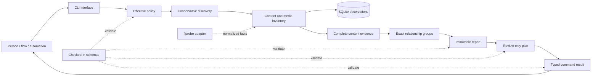

# OptiFlow Architecture

## Purpose and Scope

This document defines how OptiFlow's logical systems are structurally organized,
how dependencies may cross boundaries, and how the product participates in the
larger Ego Hygiene platform. [`SYSTEM.md`](SYSTEM.md) owns the logical system
inventory; this document owns structural rules.

The current execution boundary converts immutable filesystem observations into
evidence-backed reports and review-only plans. Mutation, transactional
replacement, validation, quarantine, and recovery are future structural units
and must not be simulated inside the read-only pipeline.

## Structural Units or Layers

### Interface Layer

Owns CLI syntax, human and machine rendering, stream behavior, and operating
system exit status.

- Modules: `cli`, `render`, the binary entry point.
- Accepts and emits versioned application values.
- Does not derive relationship evidence or infer process outcome from text.

### Application Layer

Coordinates use cases, resolves one typed command outcome, handles cooperative
interruption, and defines artifact-commit boundaries.

- Modules: `app`, `outcome`, `signals`, `configuration::resolver`.
- Receives explicit ports and fully materialized policy.
- Does not contain adapter parsing or filesystem-specific mutation.

### Domain Layer

Owns canonical concepts, evidence rules, effective policy values, inventory
classification, exact-group derivation, and plan semantics.

- Modules: `domain`, `configuration::policy`, `inventory`, `duplicates`,
  `planning`.
- Depends on data and behavior it owns rather than concrete external tools.
- Contains no shell, terminal, GitHub, container, or cloud-provider semantics.

### Evidence and Contract Layer

Owns complete hashing, checked-in machine contracts, runtime validation, and
the stable boundary between domain values and persisted or subprocess-visible
documents.

- Modules: `hashing`, `contracts`; files: `schemas/`.
- Schema identity is independent from the Rust crate version.
- Validation occurs before an artifact is reported as committed.

### Infrastructure Layer

Implements operating-system, SQLite, filesystem, external-adapter, and atomic
artifact ports.

- Modules: `filesystem`, `state`, `reports`, `adapters::ffprobe`.
- Migrations live in `migrations/` and move forward explicitly.
- External output is treated as untrusted until parsed and normalized.

### Publication Layer

Builds separate static product surfaces from `web/landing/`,
`web/architecture/`, `docs/`, and `schemas/`. It describes the application but
is not part of the CLI runtime.

- Build boundary: `scripts/site/build.sh`.
- Architecture projection: `scripts/site/generate_architecture.py` reads this
  corpus and repository-owned portal configuration without becoming a new
  architecture authority.
- Verification boundary: `scripts/site/verify.py` and strict Zensical build.
- Output: one collision-checked `dist/` tree.

## Runtime and Data Flow



The `v0.1.x` authority boundary ends after plan generation. A future execution
flow begins by loading historical evidence and then creating new current
observations; it never treats the diagram's final plan node as direct write
permission.

## Component Map

| Component | Layer | Responsibility |
| --- | --- | --- |
| `cli` | Interface | Parse commands, output mode, selectors, and traversal overrides |
| `configuration::resolver` | Application | Select, snapshot, merge, validate, and explain configuration |
| `configuration::policy` | Domain | Hold values, provenance, locked invariants, and fingerprints |
| `app` | Application | Coordinate command use cases and artifact boundaries |
| `outcome` | Application | Resolve diagnostics, coverage, artifacts, and exit semantics |
| `signals` | Application | Capture cooperative interruption without terminating library code |
| `render` | Interface | Enforce stdout/stderr ownership and buffered JSON rendering |
| `discovery` | Application/infrastructure boundary | Traverse explicit inputs under conservative policy |
| `inventory` | Domain | Normalize filesystem and media observations |
| `adapters::ffprobe` | Infrastructure | Invoke and parse `ffprobe` directly without a shell |
| `hashing` | Evidence | Stream complete BLAKE3-256 hashes with cancellation checkpoints |
| `duplicates` | Domain | Derive exact groups from equal size and complete hash evidence |
| `state` | Infrastructure | Persist lifecycle, observations, groups, and cache in SQLite |
| `planning` | Domain | Create non-mutating actions and future preconditions |
| `reports` | Infrastructure | Validate and atomically commit immutable JSON artifacts |
| `contracts` | Evidence | Compile and enforce checked-in JSON Schemas at runtime |

## Boundary Rules

1. Configuration is resolved once before domain execution. Domain modules do
   not reopen configuration files or reread environment variables.
2. Source media is opened read-only. No source-write port exists in the current
   runtime.
3. External tools are invoked without a shell, with bounded arguments and
   normalized results.
4. Path observations remain distinct from content identity.
5. Cache reuse is explicit and must acquire missing evidence when a new claim
   requires it.
6. A report is committed before another pipeline treats it as source evidence.
7. A plan is a new immutable projection and declares that it does not mutate
   files.
8. Renderers receive typed outcomes; message text never controls exit status.
9. Infrastructure orchestration consumes released CLI and artifact contracts;
   it does not embed default-branch source.
10. Publication producers build in isolation and reject final-path collisions.
11. Generated architecture projections remain disposable; canonical meaning
    changes only in the root architecture documents or their declared local
    presentation configuration.

## Dependency Direction

```text
interface
    |
    v
application -----> evidence/contracts
    |
    v
domain <--------- normalized ports
    ^
    |
infrastructure implementations
```

Higher-level policy and domain language must not depend on GitHub Actions,
Zensical, Docker, Kubernetes, cloud SDKs, SQLite row layouts, or raw `ffprobe`
JSON. Infrastructure implements the boundaries required by application and
domain use cases.

The current module graph predates a formal compile-time boundary linter. New
changes should move toward this direction without creating indirection that has
no demonstrated boundary value.

## Communication Patterns

- In-process components exchange typed Rust values.
- External adapters exchange bounded subprocess arguments and structured
  output.
- Local persistence uses transactional SQLite plus immutable JSON artifacts.
- Automation exchanges `optiflow.command-result.v1` and referenced artifacts.
- `flow` invokes the binary as a subprocess and branches on complete schema
  identifiers and exit codes.
- Future telemetry describes runtime health through a separate observability
  port and does not replace domain artifacts.

## Deployment Topology

### Current standalone topology

```text
optiflow process
├── read-only source paths
├── optional ffprobe child process
├── local SQLite state
└── immutable artifact directory
```

### Reproducible environment topology

Realm may package the same process and its declared adapters in a devcontainer
or OCI image. Source and state enter through explicit mounts. The container
does not receive broader filesystem or network access by default.

### Future scheduled topology

Relay and infrastructure code may run the OCI artifact as a local, CI, cluster,
or cloud batch job. The job remains a contract consumer. Kubernetes, serverless
containers, and provider batch systems are interchangeable scheduling adapters
only where their storage, identity, interruption, and artifact-retention
semantics satisfy OptiFlow requirements.

## Significant Constraints

- SQLite rollback journal and `FULL` synchronization are used rather than
  assuming WAL behavior on arbitrary scanned filesystems.
- Generated artifacts are written to sibling temporary files, flushed,
  synchronized, validated, and renamed.
- Handled `SIGINT` and `SIGTERM` never finalize an active run as completed.
- Full hashes are calculated only when a candidate relationship requires them
  in the current MVP.
- Direct byte confirmation remains deferred to the future destructive gate.
- OCI or cloud packaging must not introduce implicit source upload or telemetry
  containing paths or media content.

## Relationship to System Inventory

The Invocation, Discovery, Inventory, Relationship, State, Reporting,
Presentation, Contract, and Publication systems in [`SYSTEM.md`](SYSTEM.md) map
onto the layers above. The future Transactional Execution System will add
explicit execution-domain and transaction-infrastructure units instead of
expanding `planning` into an implicit apply engine.

## Assumptions and Evidence Gaps

- Architecture boundaries are documented but not yet enforced by a dedicated
  dependency rule.
- The project has not published a signed OCI image or proved a remote topology.
- Shared-state concurrency and distributed trust are unspecified.
- Final visual identity assets and runtime telemetry contracts are not frozen.
- The architecture portal is a product-local proof; shared generator ownership,
  installation, and update semantics remain future Aether and Holon concerns.

## Open Questions

- Which ports should become explicit traits before transactional execution is
  added?
- Should artifact storage remain filesystem-only or gain a content-addressed
  abstraction for remote jobs?
- What sandbox boundary is appropriate for hostile or malformed media adapters?

## Validation

- Governing specification: `architecture-architecture` version `1.1.0`.
- Structural layers, direction, boundaries, communication, constraints, and
  deployment forms are explicit.
- The document reflects the current module and data model without claiming that
  future transaction or cloud systems exist.
- Product-domain code remains independent from a specific cloud-native stack.
