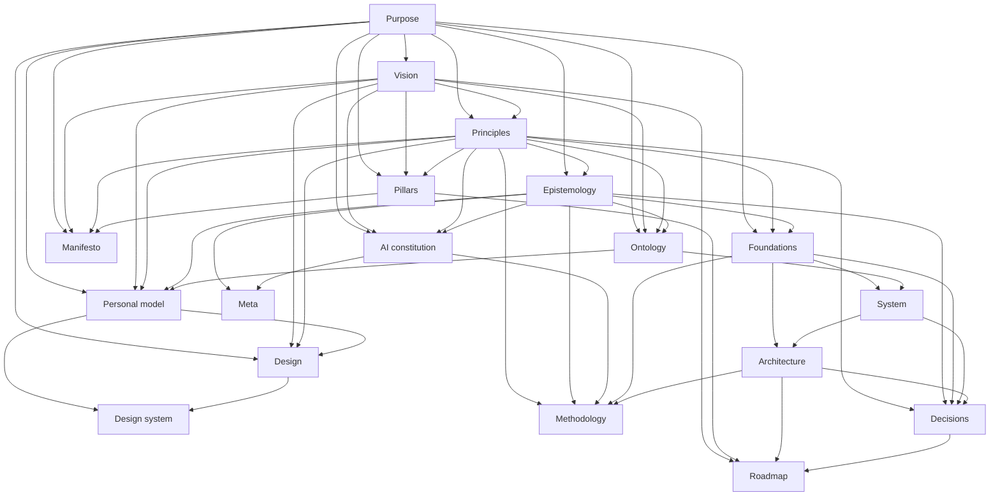

# OptiFlow Meta Architecture

## Architecture System Overview

OptiFlow uses 18 canonical root documents as a connected architecture system.
Each document owns one concern, declares stable metadata, and references other
documents rather than copying their meaning.

This is a manual adoption of the emerging Aether contract proven in Empathy.
The future Aether and Holon process may install, update, and validate the set,
but generated material must preserve repository-owned content, explicit
versions, and reviewable migrations.

## Document Categories

| Category | Question answered |
| --- | --- |
| Identity | Why does the product exist and what does it stand for? |
| Knowledge and authority | What can the system claim, and what may people or AI do? |
| Domain | Which concepts and human boundaries shape the model? |
| Foundation | What assumptions, systems, structures, methods, decisions, and direction govern implementation? |
| Experience | How should the product feel and how is that expressed consistently? |
| Meta | How does the architecture corpus itself remain coherent? |

## Document Inventory

| Document | Stable ID | Category | Governing specification |
| --- | --- | --- | --- |
| [`PURPOSE.md`](PURPOSE.md) | `optiflow-purpose` | Identity | `architecture-purpose@2.0.0` |
| [`VISION.md`](VISION.md) | `optiflow-vision` | Identity | `architecture-vision@2.0.0` |
| [`PRINCIPLES.md`](PRINCIPLES.md) | `optiflow-principles` | Identity | `architecture-principles@2.0.0` |
| [`PILLARS.md`](PILLARS.md) | `optiflow-pillars` | Identity | `architecture-pillars@2.0.0` |
| [`MANIFESTO.md`](MANIFESTO.md) | `optiflow-manifesto` | Identity | `architecture-manifesto@2.0.0` |
| [`EPISTEMOLOGY.md`](EPISTEMOLOGY.md) | `optiflow-epistemology` | Knowledge and authority | `architecture-epistemology@2.0.0` |
| [`AI_CONSTITUTION.md`](AI_CONSTITUTION.md) | `optiflow-ai-constitution` | Knowledge and authority | `architecture-ai-constitution@2.0.0` |
| [`ONTOLOGY.md`](ONTOLOGY.md) | `optiflow-ontology` | Domain | `architecture-ontology@2.0.0` |
| [`PERSONAL_MODEL.md`](PERSONAL_MODEL.md) | `optiflow-personal-model` | Domain | `architecture-personal-model@2.0.0` |
| [`FOUNDATIONS.md`](FOUNDATIONS.md) | `optiflow-foundations` | Foundation | `architecture-foundations@1.1.0` |
| [`SYSTEM.md`](SYSTEM.md) | `optiflow-system` | Foundation | `architecture-system@1.1.0` |
| [`ARCHITECTURE.md`](ARCHITECTURE.md) | `optiflow-architecture` | Foundation | `architecture-architecture@1.1.0` |
| [`METHODOLOGY.md`](METHODOLOGY.md) | `optiflow-methodology` | Foundation | `architecture-methodology@1.1.0` |
| [`DECISIONS.md`](DECISIONS.md) | `optiflow-decisions` | Foundation | `architecture-decisions@2.0.0` |
| [`ROADMAP.md`](ROADMAP.md) | `optiflow-roadmap` | Foundation | `architecture-roadmap@1.1.0` |
| [`DESIGN.md`](DESIGN.md) | `optiflow-design` | Experience | `architecture-design@2.0.0` |
| [`DESIGN_SYSTEM.md`](DESIGN_SYSTEM.md) | `optiflow-design-system` | Experience | `architecture-design-system@2.0.0` |
| [`META.md`](META.md) | `optiflow-meta` | Meta | `architecture-meta@2.0.0` |

## Canonical Ownership Map

| Concern | Canonical document |
| --- | --- |
| Enduring reason and beneficiaries | `PURPOSE.md` |
| Desired future and anti-vision | `VISION.md` |
| Decision heuristics and precedence | `PRINCIPLES.md` |
| Initiative-scale commitments | `PILLARS.md` |
| Ethical and emotional declaration | `MANIFESTO.md` |
| Evidence, claims, uncertainty, and knowledge | `EPISTEMOLOGY.md` |
| AI and agent authority | `AI_CONSTITUTION.md` |
| Domain concepts and language | `ONTOLOGY.md` |
| Minimal human and consent model | `PERSONAL_MODEL.md` |
| Assumptions, invariants, constraints, and mental models | `FOUNDATIONS.md` |
| Logical systems and ownership | `SYSTEM.md` |
| Layers, dependencies, boundaries, and topology | `ARCHITECTURE.md` |
| Engineering and technology-evaluation process | `METHODOLOGY.md` |
| Durable accepted trade-offs | `DECISIONS.md` |
| Sequenced product direction | `ROADMAP.md` |
| Intended human experience | `DESIGN.md` |
| Reusable visual and content language | `DESIGN_SYSTEM.md` |
| Architecture inventory, graph, and lifecycle | `META.md` |

Product specifications, schemas, migrations, tests, API references, runbooks,
and generated diagrams remain separate implementation or evidence artifacts.
They reference this corpus where architecture meaning is required.

## Relationship Graph



`depends_on` edges form an acyclic authoring graph. `related` edges support
navigation without creating precedence.

## Reading Order

For product orientation:

1. `PURPOSE.md`, `VISION.md`, and `MANIFESTO.md`.
2. `PRINCIPLES.md` and `PILLARS.md`.
3. `EPISTEMOLOGY.md`, `ONTOLOGY.md`, and `PERSONAL_MODEL.md`.
4. `FOUNDATIONS.md`, `SYSTEM.md`, and `ARCHITECTURE.md`.
5. `DESIGN.md` and `DESIGN_SYSTEM.md`.
6. `AI_CONSTITUTION.md`, `METHODOLOGY.md`, and `DECISIONS.md`.
7. `ROADMAP.md` and this inventory.

For a scoped code change, read the smallest owning path plus the relevant
product specification and contract. A source-media authority change always
includes `PRINCIPLES.md`, `FOUNDATIONS.md`, `ARCHITECTURE.md`, `DECISIONS.md`,
and `docs/safety-model.md`.

## Authoring Order

The complete topological authoring order is:

```text
PURPOSE
  -> VISION
  -> PRINCIPLES
  -> PILLARS + EPISTEMOLOGY
  -> MANIFESTO + ONTOLOGY + AI_CONSTITUTION + FOUNDATIONS
  -> PERSONAL_MODEL + SYSTEM
  -> ARCHITECTURE + DESIGN
  -> DESIGN_SYSTEM + METHODOLOGY + DECISIONS
  -> ROADMAP
  -> META
```

Parallel branches in the order may be authored independently after their
declared dependencies are stable.

## Lifecycle and Validation Status

All documents currently use version `0.1.0` and status `draft`. Draft means the
corpus is canonical working architecture but still expected to change before
the first stable product release.

The current validation contract is manual for OptiFlow:

- exactly one H1 and a `Validation` section per document;
- complete `aether.architecture-document/v1` metadata;
- unique `optiflow-*` IDs;
- resolved `depends_on`, `related`, and `supersedes` relationships;
- an acyclic dependency graph;
- no template placeholders;
- Markdown and link validation through repository tooling where applicable.

The organization-wide checking gate is intentionally deferred until the
universal file set and Aether/Holon materialization contract stabilize.

## Change Propagation

1. Change the canonical owning document.
2. Identify downstream `depends_on` consumers.
3. Update affected specifications, schemas, tests, implementation, and user
   documentation.
4. Record a decision when meaning, authority, compatibility, or ownership
   changes materially.
5. Increment document version when the architecture contract changes.
6. Preserve superseded meaning and migration guidance.

Generated or installed projections never overwrite repository-owned changes
without a visible three-way plan and human review.

## Gaps and Intentional Omissions

- The Aether specification package is referenced by ID but not installed as a
  released dependency in OptiFlow.
- Holon does not yet materialize or update this document set.
- No repository gate currently enforces the metadata graph.
- Mermaid remains available for document-local diagrams. The publication build
  now derives an interactive SVG document graph and JSON projection from this
  corpus; PlantUML, Excalidraw, and infographic projections remain future
  derivatives.
- Organization-wide CNCF technology selection belongs in Aether or the
  organization architecture, not this product corpus.

## Open Questions

- Which metadata fields should become stable across every repository?
- How will Aether versions and repository-owned document versions interact?
- What exception format will allow a repository to omit an inapplicable
  document without reporting false conformance?
- Should generated visual projections be committed, published, or built only?

## Validation

- Governing specification: `architecture-meta` version `2.0.0`.
- The inventory covers all 18 canonical documents and governing specifications.
- Ownership, graph, reading order, authoring order, lifecycle, and gaps are
  explicit.
- Every declared dependency resolves and the graph is acyclic.
