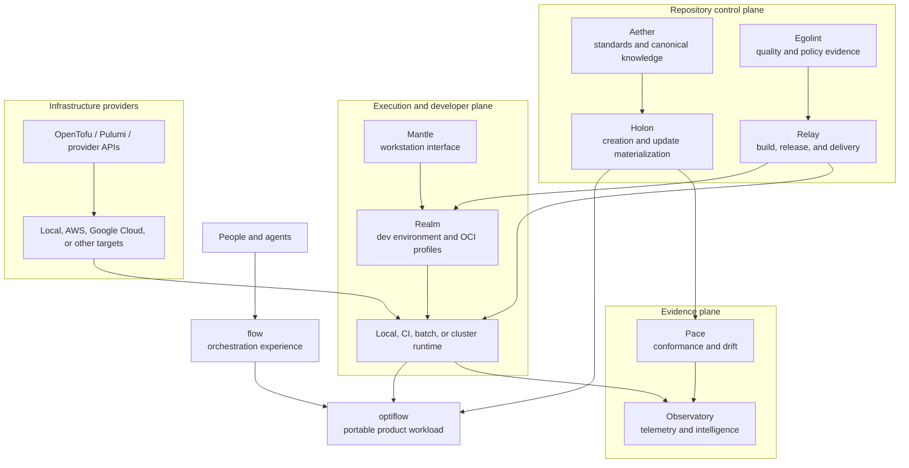

# Cloud-native placement

The [CNCF Cloud Native Landscape](https://landscape.cncf.io/) is a categorical
map of cloud-native projects and products. It is useful for discovering and
comparing capability providers; it is not a reference stack and does not imply
that a platform should install one project from every category.

OptiFlow is an independently useful application workload. It owns media
evidence and decision contracts. Packaging, delivery, orchestration,
observability, infrastructure, and organization policy belong to the platform
around it.

## Placement model



The arrows indicate composition and evidence flow, not source-code dependency.
Each repository retains its own release and contract boundary.

## Platform design rule

The CNCF platform whitepaper describes platforms as products that curate
foundational capabilities behind consistent interfaces, self-service paths,
documentation, secure defaults, and reduced cognitive load while remaining
optional and composable. That is the architectural role of the Ego Hygiene
platform: present a small golden path to products such as OptiFlow without
forcing each product to operate the underlying providers.

See the CNCF TAG App Delivery
[platforms whitepaper](https://github.com/cncf/tag-app-delivery/blob/main/platforms-whitepaper/latest/index.md).

## Ego Hygiene capability ownership

| Repository | Platform role | Relevant cloud-native capability families |
| --- | --- | --- |
| Aether | Canonical architecture, policies, schemas, skills, and golden-path knowledge | Application definition, policy models, specifications |
| Holon | Idempotent repository creation, update, projection, migration, and drift plans | Platform APIs, templates, software catalogs, configuration automation |
| Egolint | Local and CI quality, security, contract, architecture, and supply-chain checks | Security and compliance, policy enforcement, vulnerability analysis |
| Relay | Reusable build, test, package, sign, publish, deploy, and promotion workflows | CI/CD, image build, registries, GitOps, provenance |
| Mantle | Portable workstation commands and shell experience | Developer tooling and local interfaces |
| Realm | Reproducible development environments, OCI images, local services, and runtime profiles | Containers, runtimes, local orchestration, environment composition |
| Flow | User-facing orchestration across independently released tools | Platform interface, workflow orchestration, portal or CLI experience |
| Observatory | Operational and repository intelligence | OpenTelemetry, metrics, logs, traces, dashboards |
| Pace | Desired-state conformance, synchronization, exceptions, and drift evidence | Policy, configuration, GitOps reconciliation |
| OptiFlow | Media evidence, relationship proof, planning, and future transactional action | Application workload; it consumes platform capabilities through contracts |

This separation lets one capability provider change without redefining every
product. For example, Realm may move from a Docker Compose profile to a local
Kubernetes profile while OptiFlow continues to expose the same CLI and artifact
contracts.

## Where CNCF categories fit

| Landscape capability | Platform owner | OptiFlow relationship |
| --- | --- | --- |
| Application definition and image build | Realm and Relay | Build a declared OCI workload from released source |
| Container registry | Relay and infrastructure | Publish verified images, checksums, SBOMs, and provenance |
| Continuous integration and delivery | Relay | Execute the canonical validation and promotion lifecycle |
| Scheduling and orchestration | Realm or infrastructure | Run an explicit OptiFlow job; never redefine evidence policy |
| Cloud-native storage | Infrastructure | Supply explicit source/state/artifact mounts after filesystem semantics are proven |
| Observability | Observatory | Collect health telemetry; immutable artifacts remain domain evidence |
| Security and compliance | Egolint, Relay, Pace | Scan source and images, verify policy, signatures, and deployment state |
| Key management | Infrastructure | Supply runtime credentials without placing them in repositories or artifacts |
| Service discovery, networking, gateway, or mesh | Infrastructure | Relevant only if OptiFlow becomes a network service or distributed worker system |
| Automation and configuration | Holon, Pace, infrastructure | Materialize declared desired state and expose drift |
| Continuous optimization | Observatory or infrastructure | Optimize platform cost and resources, not source-media disposition |

## OptiFlow's portable workload contract

The first containerized OptiFlow form should remain intentionally small:

```text
OCI image
├── optiflow binary
├── declared optional adapters such as ffprobe
├── read-only source mount
├── writable state mount
├── writable artifact mount
└── explicit command and effective policy
```

The current product reads filesystem paths. Mounting object storage through an
adapter does not automatically make its consistency, identity, locking, or
atomicity semantics supported. Native object-storage inputs require a separate
port and evidence model.

A scheduled job retains:

- image digest and release identity;
- exact command and effective policy artifact;
- typed command result and exit status;
- run, report, and plan artifacts;
- adapter versions and relevant runtime facts;
- logs and telemetry with private paths or media content excluded by default.

## Adoption ladder

### Stage 0 — Portable application

Use the existing Rust binary, Taskfile, GitHub Actions, schemas, and static
documentation. Complete packaging, release provenance, and supported-platform
installation before introducing a cluster.

### Stage 1 — Reproducible local platform

Realm supplies a baseline devcontainer and OCI image. Flow invokes OptiFlow
through its released subprocess contract. Local Compose, `kind`, or `k3d` may be
used as learning and integration environments when they solve a test need.

### Stage 2 — Observable signed workload

Relay builds multi-architecture images, generates SBOMs, signs artifacts with a
Sigstore-compatible process, scans them, and publishes immutable releases.
Define an OpenTelemetry-compatible runtime boundary before choosing one metrics,
log, or trace backend.

### Stage 3 — Declarative deployment

When multiple services or repeated jobs create a real operational need, adopt a
declarative scheduler. Helm or Kustomize can package Kubernetes resources; Flux
or Argo CD can reconcile Git state. Kyverno or OPA-based policy can enforce
deployment constraints.

The first production target may still be a provider-native batch service if it
has lower operational cost and meets the workload contract.

### Stage 4 — Self-service multi-environment platform

OpenTofu or Pulumi provisions provider resources from explicit infrastructure
modules. Crossplane becomes relevant when infrastructure itself should be
offered through Kubernetes-native self-service APIs. Backstage becomes relevant
when a software catalog and golden-path portal reduce demonstrated user
cognitive load.

Service meshes, complex event systems, and multi-cluster control planes remain
need-driven additions rather than maturity badges.

## Selection rubric

Before adopting a landscape project, record:

1. the user or operator problem;
2. the repository that owns the capability;
3. why an existing provider or simpler mechanism is insufficient;
4. CNCF maturity and real-world adoption;
5. data, identity, network, and permission boundaries;
6. local and CI reproducibility;
7. operational burden for one maintainer;
8. interface and replacement cost;
9. validation, observability, backup, and recovery behavior;
10. exit or removal conditions.

[CNCF project maturity](https://www.cncf.io/projects/) describes graduated
projects as stable, widely adopted, and production ready; incubating projects
have demonstrated production use and healthy contributors; sandbox projects
are experimental. Maturity informs risk but does not replace product fit.

## Learning path

The most useful sequence for learning while building Ego Hygiene is:

1. OCI images, registries, digests, mounts, and runtime isolation.
2. Kubernetes workloads, Jobs, storage, configuration, identity, and failure
   behavior.
3. Helm or Kustomize and environment overlays.
4. GitOps reconciliation with Flux or Argo CD.
5. OpenTelemetry concepts, followed by Prometheus/Grafana and log or trace
   backends as needed.
6. SBOMs, signing, provenance, admission policy, and runtime security.
7. Platform engineering through golden paths, catalogs, and self-service APIs.
8. Multi-cloud IaC and Crossplane only after one target is reproducible.

This order builds the mental model from artifact to runtime to platform instead
of beginning with a pile of products.

## An Ego Hygiene landscape

The organization can later maintain a small, curated landscape of selected,
evaluating, and rejected capabilities. CNCF's
[`landscape2`](https://github.com/cncf/landscape2) can generate and validate a
static landscape from YAML data and settings.

That artifact should record ownership and lifecycle rather than mirror every
CNCF entry:

```text
candidate -> experiment -> selected -> active -> deprecated -> removed
```

Its canonical data belongs with organization architecture in Aether or the
`egohygiene.io` architecture source. OptiFlow should link to that projection and
record only product-specific integration decisions.

## Current decision

OptiFlow adopts cloud-native compatibility, not cloud-native dependency. The
core remains a local-first application. Platform repositories may package,
schedule, secure, and observe it through versioned contracts as concrete needs
arrive.

See the repository-level
[`SYSTEM.md`](https://github.com/egohygiene/optiflow/blob/main/SYSTEM.md),
[`ARCHITECTURE.md`](https://github.com/egohygiene/optiflow/blob/main/ARCHITECTURE.md),
and decision `OFD-009` in
[`DECISIONS.md`](https://github.com/egohygiene/optiflow/blob/main/DECISIONS.md).
