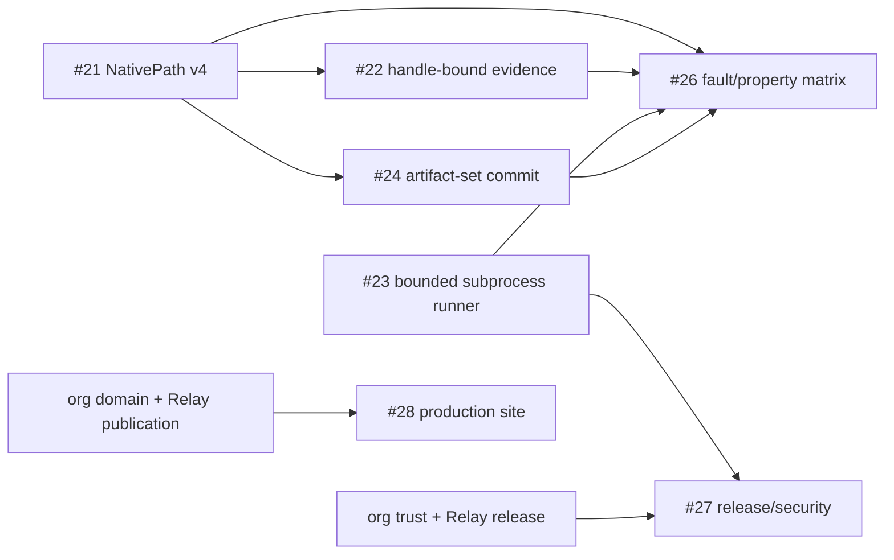

# Current Release Milestone — v0.1.x Hardening

This is the compact execution view for the current OptiFlow release milestone. `ROADMAP.md` remains the long-horizon product roadmap; this file answers **what is dependency-ready now?**

## Milestone objective

Ship a trustworthy read-only `v0.1.x` foundation whose paths, observation evidence, external-tool execution, artifact publication, fault behavior, and release evidence are strong enough to support public distribution before source mutation is introduced.

## Ready now

### #21 — lossless NativePath schema v4

**Priority:** P0  
**Dependencies:** none

Make path identity lossless across SQLite, JSON, plans, reports, logs, and CLI boundaries. This is upstream of handle-bound observation and artifact-set work because persisted identity must be trustworthy first.

### #23 — typed bounded subprocess runner

**Priority:** P0  
**Dependencies:** none

Centralize ffprobe/future adapter execution with argv-only invocation, bounded stdout/stderr, timeouts, cancellation, concurrency, and typed errors.

These two issues can proceed in parallel because their core contracts are independent.

## Ready after #21

### #22 — handle-bound observation evidence

Bind evidence to the same opened handle/equivalent platform primitive and reject races where guarantees cannot be established.

### #24 — artifact-set commit protocol

Publish run/report/plan related outputs as one coherent set with staging, commit markers, recovery semantics, and explicit durability boundaries.

**Implementation status:** complete on the working hardening branch; pending
review and merge.

## Integration proof after #21–#24

### #26 — adversarial fault and property-test matrix

Exercise filesystem races, symlinks, permissions, mount boundaries, database faults, corrupt artifacts, hostile metadata, serialization invariants, and bounded fuzz/fault targets against the hardened contracts.

## Release gate after #23 + organization dependencies

### #27 — dependency/security/signed-release policy

Requires the bounded subprocess foundation plus organization trust/release automation. This issue is the public-release supply-chain gate, not a reason to block correctness work in #21–#24.

## Site deployment track

### #28 — production optiflow.egohygiene.io deployment

The site composition itself is already implemented and validated. Final domain/TLS/redirect/rollback work waits on organization domain and Relay publication dependencies. It can proceed without changing the CLI safety milestone, but the public site must not advertise unsupported mutation/release guarantees.

## Dependency graph

## Milestone exit checklist

- [ ] Native paths round-trip losslessly through every supported artifact/state boundary.
- [ ] Observation evidence cannot silently combine incompatible file states.
- [ ] External tools cannot produce unbounded output or hang the process indefinitely.
- [x] Related artifacts are distinguishable as committed, incomplete, or incompatible sets.
- [ ] Adversarial/fault tests exercise the combined invariants.
- [ ] Public packages have the agreed dependency/security/provenance evidence.
- [ ] Installation and supported-platform smoke tests pass from packaged artifacts.
- [ ] Documentation and product-site claims match the actual release contract.

## What comes after

Only after this milestone earns trustworthy read-only distribution should `v0.2.0` introduce transactional exact-duplicate source mutation. The mutation roadmap remains governed by the safety invariants in `ROADMAP.md` and `ARCHITECTURE.md`.
